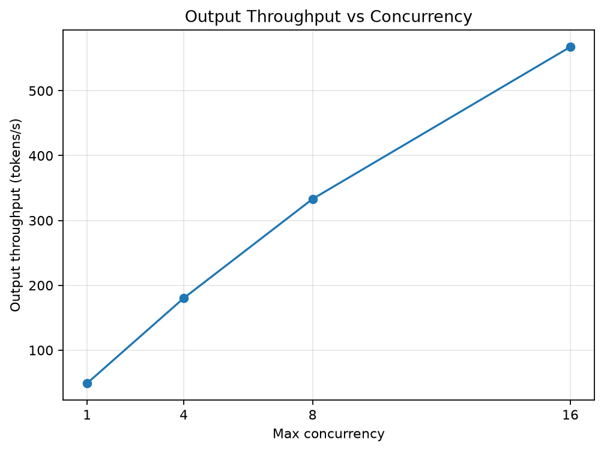
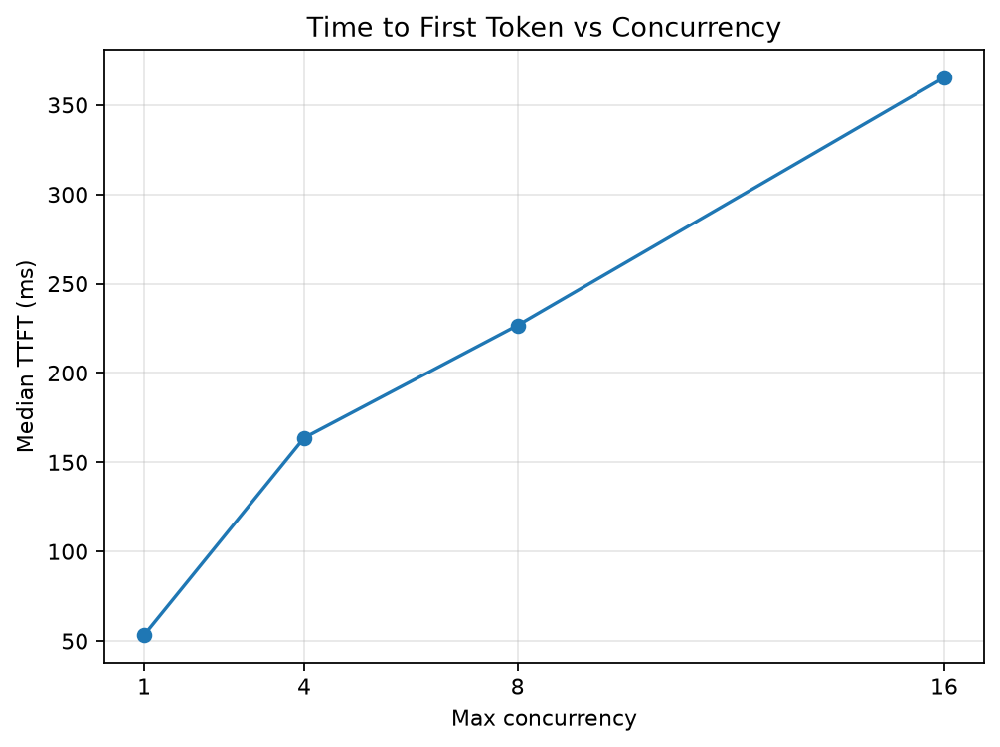
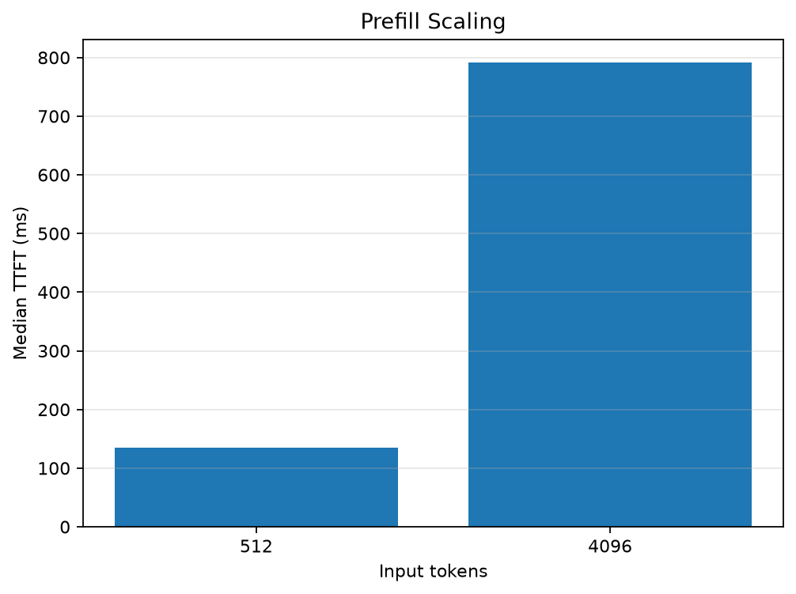
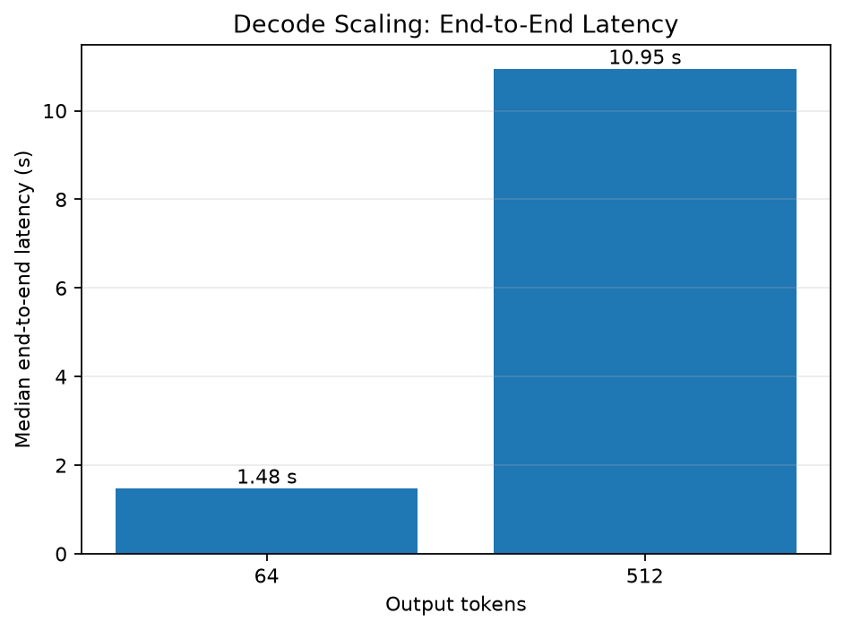
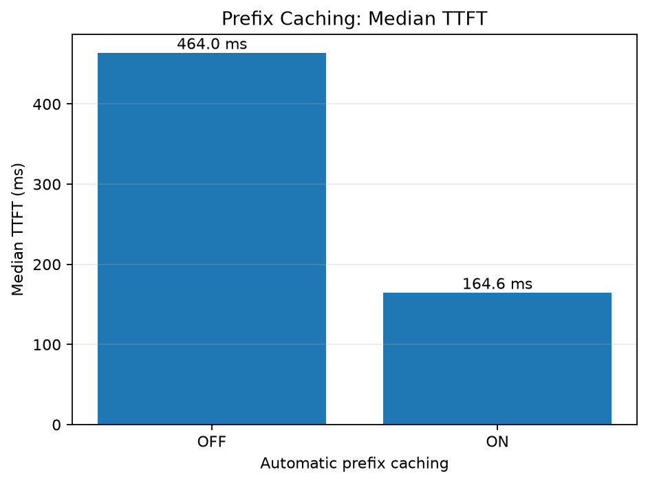

# Findings

This benchmark characterizes single-GPU vLLM inference behavior under controlled changes in concurrency, prompt length, generation length, and automatic prefix caching.

## Experimental Context

- GPU: NVIDIA L40S 48 GB
- Model: Qwen/Qwen2.5-7B-Instruct
- Serving engine: vLLM 0.30.0
- Maximum model length: 8192
- GPU memory utilization target: 0.90
- Deterministic decoding: `temperature = 0`
- Synthetic random workloads with fixed input/output lengths
- All reported benchmark requests completed successfully

## E1 - Concurrency Scaling

The workload was held at 512 input tokens and 128 output tokens while
maximum concurrency increased from 1 to 16.

| Concurrency | Request throughput (req/s) | Output throughput (tok/s) | Median TTFT (ms) | P99 TTFT (ms) | Median TPOT (ms) | Median E2E (ms) |
|---:|---:|---:|---:|---:|---:|---:|
| 1 | 0.383 | 49.0 | 53.4 | 64.4 | 20.12 | 2608 |
| 4 | 1.408 | 180.3 | 163.7 | 222.5 | 21.03 | 2840 |
| 8 | 2.603 | 333.2 | 226.7 | 350.4 | 21.53 | 2960 |
| 16 | 4.435 | 567.6 | 365.4 | 623.7 | 22.91 | 3273 |

 

### Observation

Increasing concurrency from 1 to 16 increased output-token throughput from 49.0 to 567.6 tokens/s, an approximately 11.6× increase.

The throughput gain came with a substantial first-token latency cost.  
Median TTFT increased from 53.4 ms to 365.4 ms, while P99 TTFT increased from 64.4 ms to 623.7 ms.

In contrast, median TPOT increased much more modestly, from 20.12 ms to 22.91 ms. Median end-to-end latency increased from approximately 2.61 s to 3.27 s.

### Interpretation

vLLM converted higher concurrency into substantial aggregate throughput, but scaling was not free.  
Service-level TTFT degradation for admitted requests appeared much more strongly than steady-state token-generation latency.

This pattern is consistent with increasing scheduling, queueing, batching, and prefill pressure as more requests compete for the GPU, while the per-token decode rate remained comparatively stable.

### Engineering Implication

Maximum throughput should not be the only optimization target for an
interactive serving system. Concurrency should be selected against a
latency SLO or goodput target: additional batching can improve GPU
utilization and throughput while simultaneously making first-token
responsiveness unacceptable.

## E2 - Prefill Scaling

Output length was held at 64 tokens and concurrency at 4 while input
length increased from 512 to 4096 tokens.

| Input tokens | Request throughput (req/s) | Output throughput (tok/s) | Median TTFT (ms) | P99 TTFT (ms) | Median TPOT (ms) | Median E2E (ms) |
|---:|---:|---:|---:|---:|---:|---:|
| 512 | 2.687 | 172.0 | 135.2 | 224.9 | 21.44 | 1485 |
| 4096 | 1.547 | 99.0 | 791.4 | 1175.8 | 28.32 | 2579 |

### Observation

Increasing input length by 8× increased median TTFT from 135.2 ms to
791.4 ms, approximately 5.85×. P99 TTFT increased from 224.9 ms to
1175.8 ms.

Request throughput and output-token throughput both fell by approximately
42%. Median end-to-end latency increased by approximately 74%.

Median TPOT also increased from 21.44 ms to 28.32 ms even though output
length was unchanged.

### Interpretation

Long prompts imposed a substantially larger prefill cost, which appeared
most clearly in TTFT. The experiment also shows that prefill pressure is
not necessarily isolated from the rest of the serving system: under
concurrency, the larger input workload also coincided with lower request
throughput and higher token-generation latency.

The very high total-token throughput of the 4096-token workload should
not be interpreted as better user-facing performance; that metric counts
the much larger number of input tokens being processed.

### Engineering Implication

For long-context workloads, reducing or avoiding repeated prefill work can
be more valuable than focusing exclusively on decode speed. Context
pruning, prompt compaction, prefix reuse, and prefill-oriented
optimizations should be considered when TTFT is the dominant latency
problem.

## E3 - Decode Scaling

Input length was held at 512 tokens and concurrency at 4 while output
length increased from 64 to 512 tokens.

| Output tokens | Request throughput (req/s) | Output throughput (tok/s) | Median TTFT (ms) | Median TPOT (ms) | Median E2E (ms) |
|---:|---:|---:|---:|---:|---:|
| 64 | 2.676 | 171.3 | 153.6 | 21.42 | 1479 |
| 512 | 0.365 | 187.0 | 158.3 | 21.10 | 10947 |

### Observation

Increasing output length by 8× had very little effect on first-token or
per-token latency. Median TTFT increased by only about 3%, from 153.6 ms
to 158.3 ms, while median TPOT remained essentially unchanged.

The effect on task-completion latency was very different. Median
end-to-end latency increased from approximately 1.48 s to 10.95 s,
roughly 7.4×.

Request throughput fell by approximately 86%, from 2.68 to 0.37
requests/s, even though aggregate output-token throughput increased
slightly from 171.3 to 187.0 tokens/s.

### Interpretation

Long generations are fundamentally different from long prompts.

The first token can still arrive quickly and tokens can continue streaming at approximately the same per-token rate, while the complete request remains active for much longer. As a result, completed-request throughput falls sharply even though token throughput remains healthy.

### Engineering Implication

TTFT alone is insufficient for evaluating a streaming LLM application.
Systems with long generations should also track TPOT, end-to-end
completion latency, and completed-request throughput.

Output-length control and decode-focused optimizations become important
for these workloads. Techniques such as speculative decoding should be
evaluated against this type of decode-heavy workload rather than assumed
to improve every latency regime.

## E4 - Automatic Prefix Caching

The workload used a 2048-token input consisting of a 1536-token shared prefix plus 512 variable tokens. Output length was 64 tokens and concurrency was 4.
For the cache-enabled condition, the shared prefix was prewarmed with 10 requests before the measured benchmark run.

| Prefix caching | Request throughput (req/s) | Output throughput (tok/s) | Median TTFT (ms) | P99 TTFT (ms) | Median TPOT (ms) | Median E2E (ms) |
|---|---:|---:|---:|---:|---:|---:|
| OFF | 2.039 | 130.5 | 464.0 | 1035.1 | 23.43 | 1940 |
| ON | 2.637 | 168.8 | 164.6 | 345.4 | 21.56 | 1510 |

### Observation

In the prewarmed cache-enabled condition, median TTFT was 164.6 ms compared with 464.0 ms with caching disabled, a 64.5% reduction in the observed run.

Request throughput and output-token throughput both increased by
approximately 29%.

Median end-to-end latency fell by approximately 22%, while median TPOT
improved much less, by approximately 8%.

### Interpretation

The strongest improvement appeared in TTFT rather than TPOT, which is consistent with the mechanism being tested: cached KV blocks allow the serving engine to avoid recomputing much of the repeated prefix during prefill, while newly generated decode tokens still require computation.

The result shows a substantial TTFT benefit for this prewarmed shared-prefix workload.

### Engineering Implication

Applications with repeated system prompts, tool schemas, few-shot
examples, document prefixes, or stable conversation context can benefit
materially from prefix reuse.

Prefix caching should not, however, be treated as a general solution to
decode-heavy latency. Its largest benefit in this experiment was in
first-token latency and prefill-related work.

## Overall Conclusions

The experiments demonstrate that "LLM latency" is not a single
performance characteristic.

1. **Concurrency trades responsiveness for throughput.**
   vLLM achieved strong aggregate throughput scaling as concurrency
   increased, but TTFT degraded much faster than TPOT.

2. **Long prompts primarily expose prefill pressure.**
   Increasing input length substantially increased TTFT and reduced
   request throughput even when output length remained fixed.

3. **Long outputs primarily expose decode and completion-time pressure.**
   Increasing generation length left TTFT and TPOT nearly unchanged but
   increased end-to-end task latency dramatically and sharply reduced
   completed requests per second.

4. **Prefix caching can remove significant repeated prefill work.**
   For a workload with a large shared prefix, caching produced a major
   reduction in TTFT and a meaningful throughput improvement while
   affecting decode-token latency much less.

These results reinforce the need to diagnose the dominant workload phase
before selecting an optimization. A prefill-heavy workload, a
decode-heavy workload, and a concurrency-limited workload can exhibit
very different latency signatures even when they use the same model,
serving engine, and GPU.

## Limitations

These results characterize one controlled serving configuration rather
than provide universal performance claims.

The benchmark uses:

- a single NVIDIA L40S GPU;
- one model, Qwen2.5-7B-Instruct;
- one serving engine, vLLM 0.30.0;
- synthetic fixed-length random workloads;
- a limited set of concurrency and sequence-length configurations;
- one primary benchmark run per reported condition.

Production traffic can contain heterogeneous request lengths, bursty
arrival patterns, application-level preprocessing, retrieval or tool
latency, and different cache-hit distributions.

Future experiments should therefore validate these observations across
additional serving engines, precisions, workload distributions, and
repeated runs.
